# This is the old version of uni-verse's frontend, which is being re-written in Svelte. 
# Please rather check [the rewrite](https://github.com/uni-verse-fm/uni-verse-frontend)

Uni-verse est une plateforme de streaming audio conçue spécifiquement pour les producteurs de musique.
Elle consiste en un site web, une application smartphone, et une API.

Ce projet est le site web de Uni-verse.

Le site permet de téléverser et consulter les publications (`release`), de téléverser et télécharger les packs de ressources, de commenter les tracks avec des avis positifs ou négatifs, de rechercher du contenu, de créer des playlists, ou encore de donner aux utilsateurs ou à la plateforme.

Actuellement, Uni-verse est en ligne à l'[addresse suivante](https://uni-verse.vagahbond.com).

## Structure du site web:

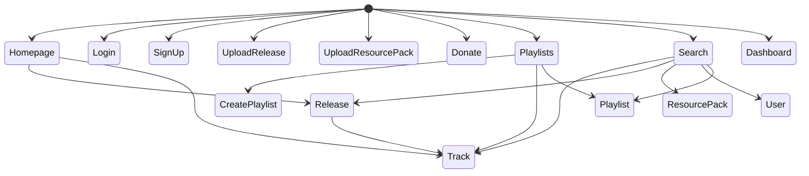

### Accueil

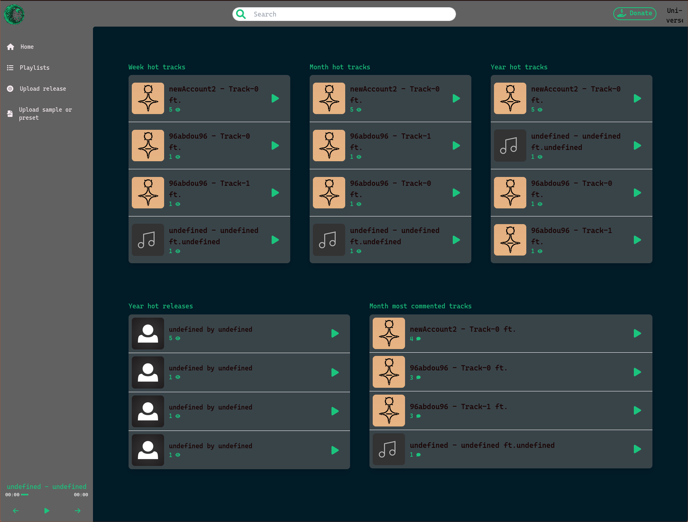

### Connexion

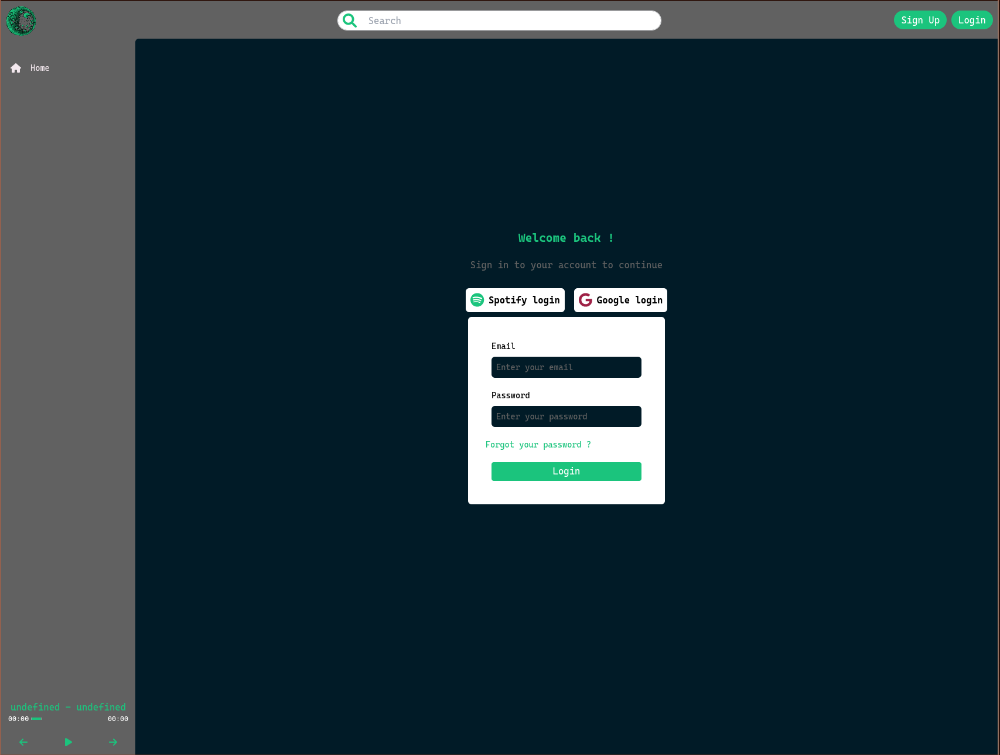

### Inscription

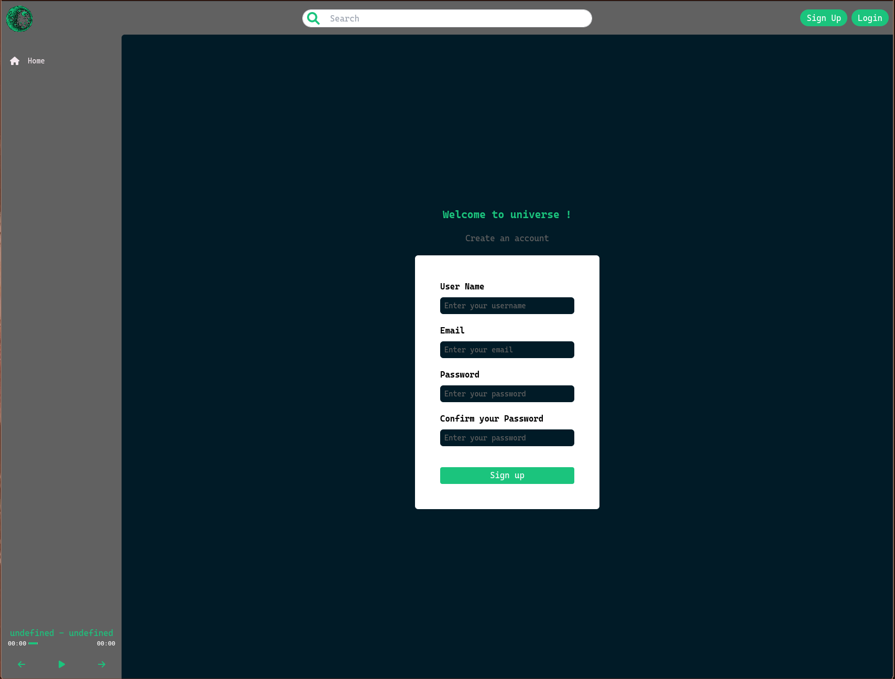

### Release

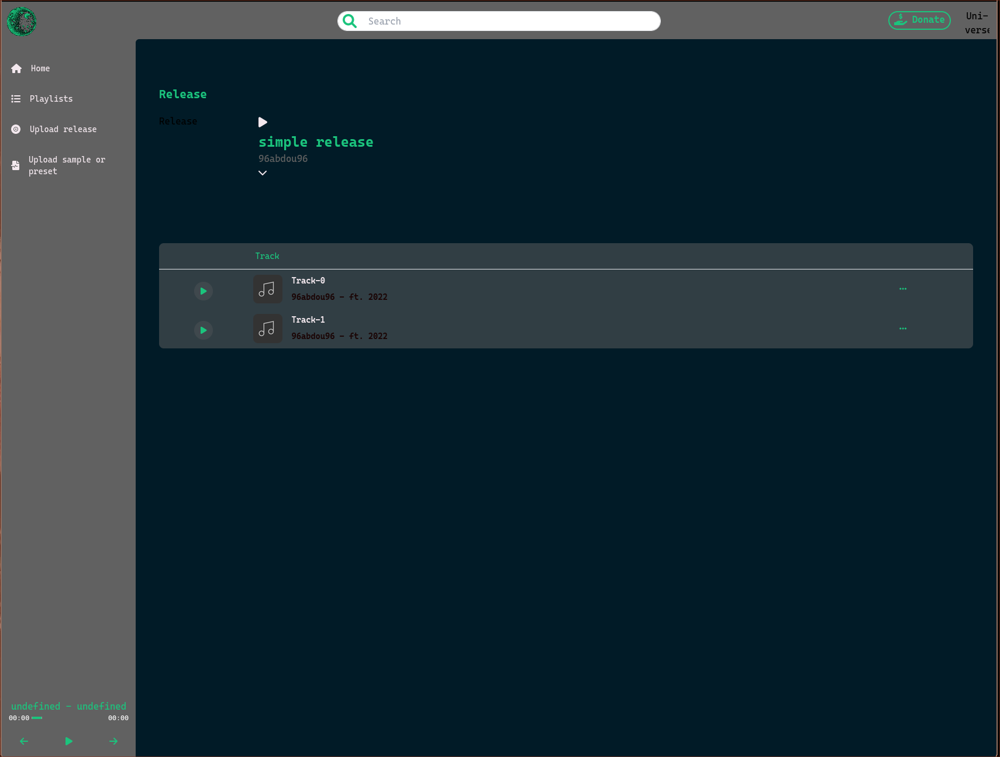

### Créer une release

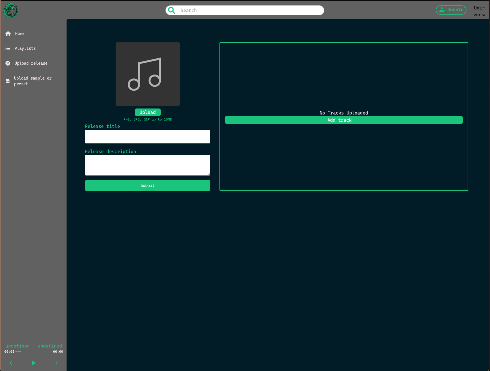

### Pack de ressources


### Créer un pack de ressources

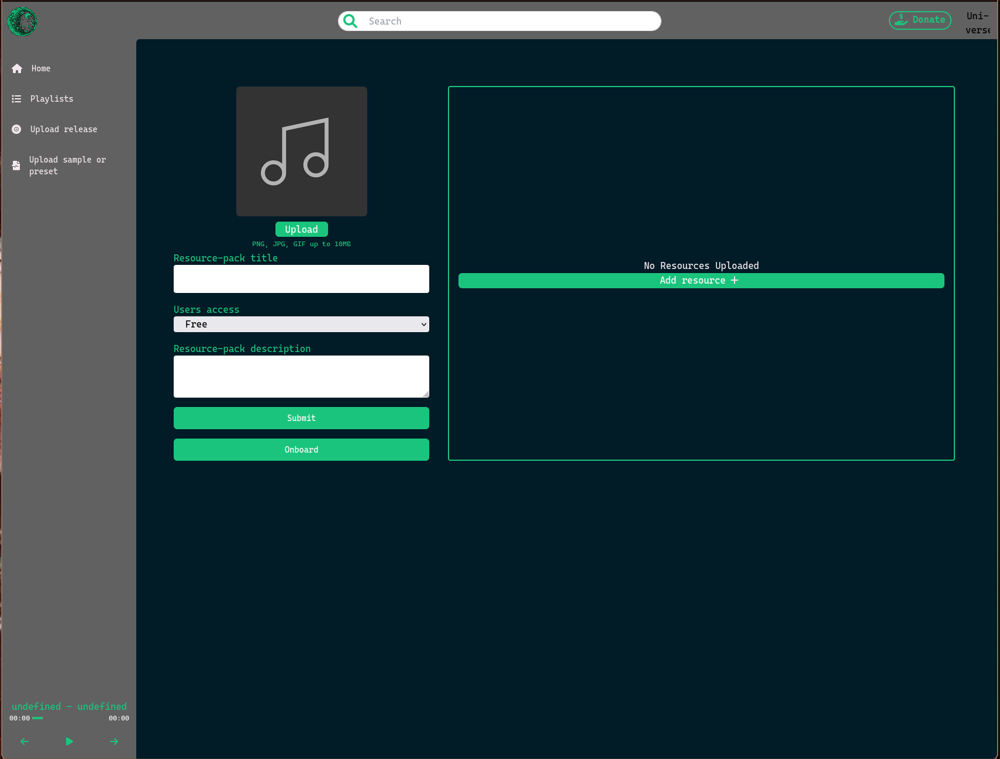

### Playlists

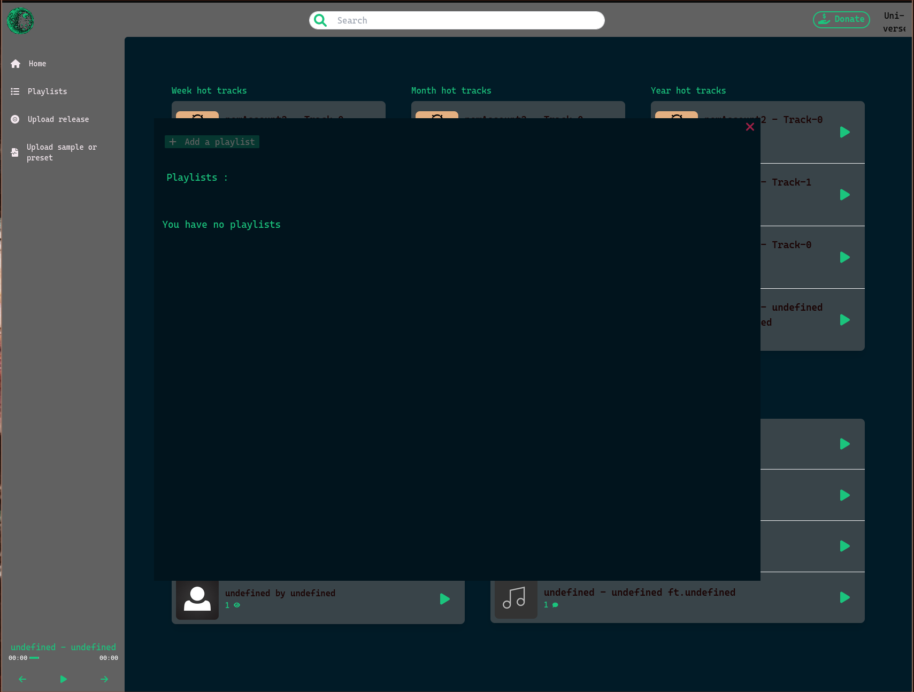

### Playlist

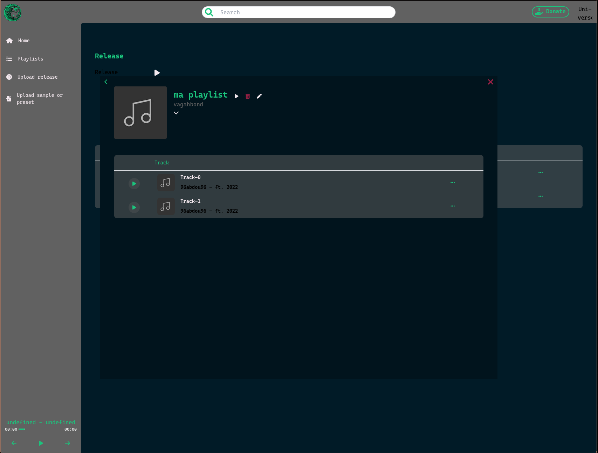

### Créer Playlist

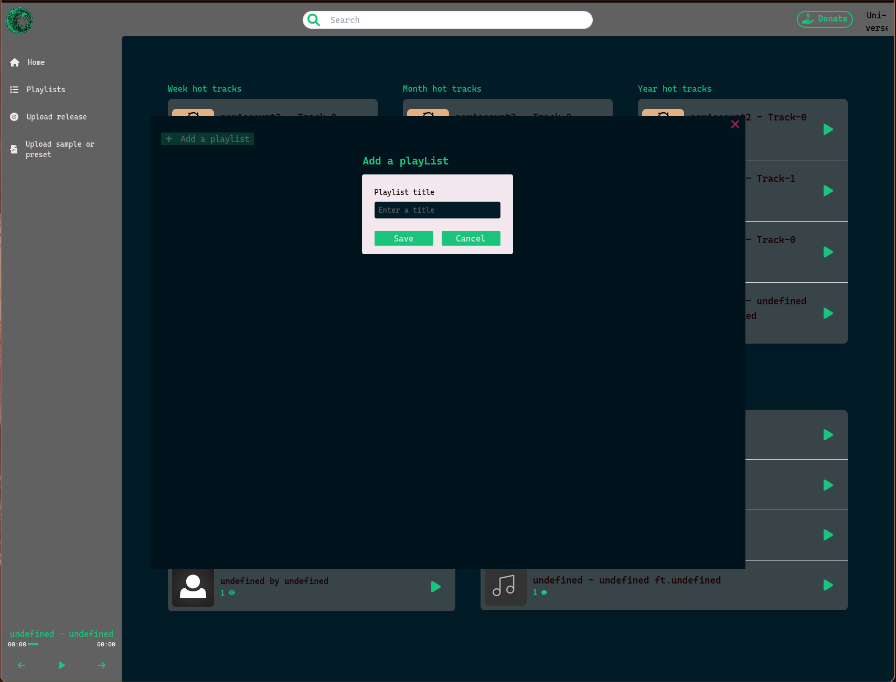

### Rechercher

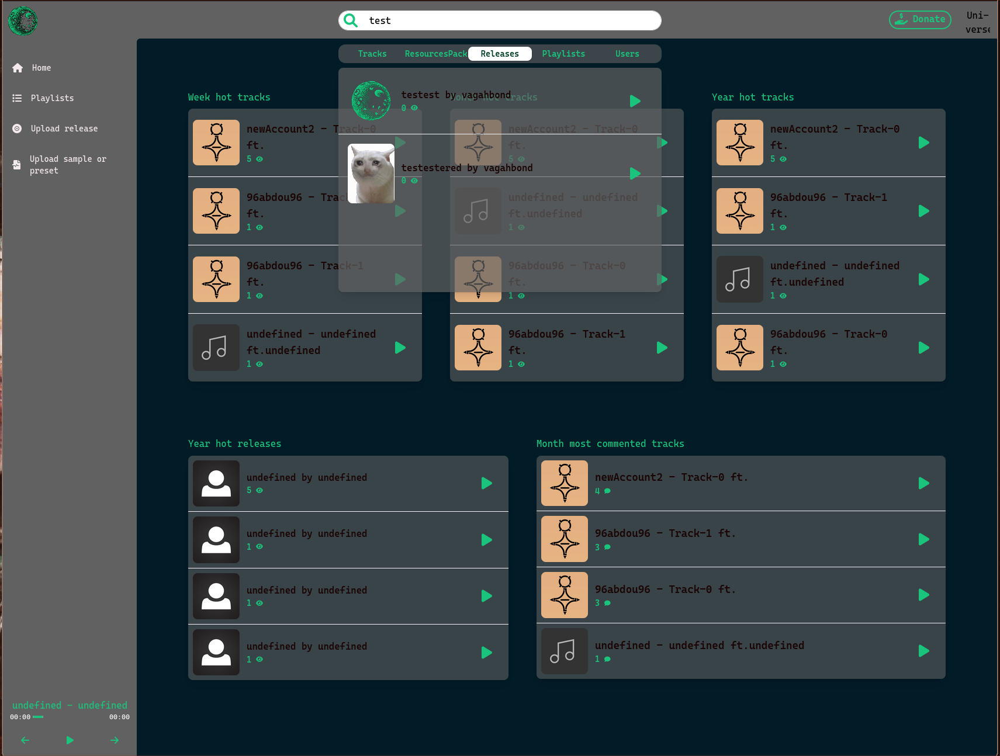

### Utilisateur

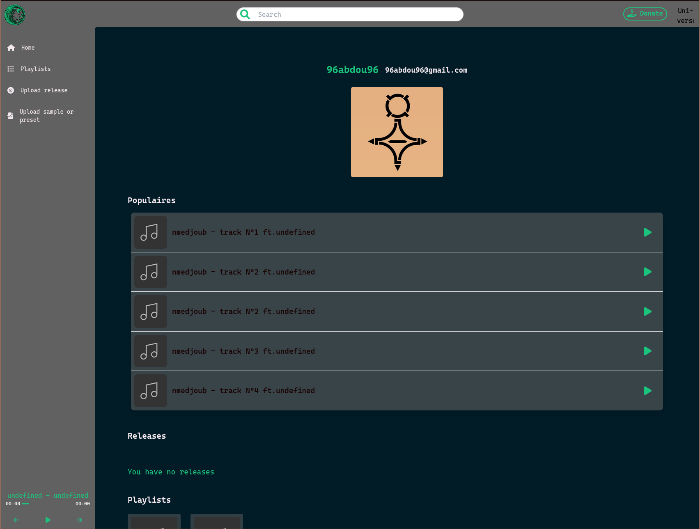

### Tableau de bord

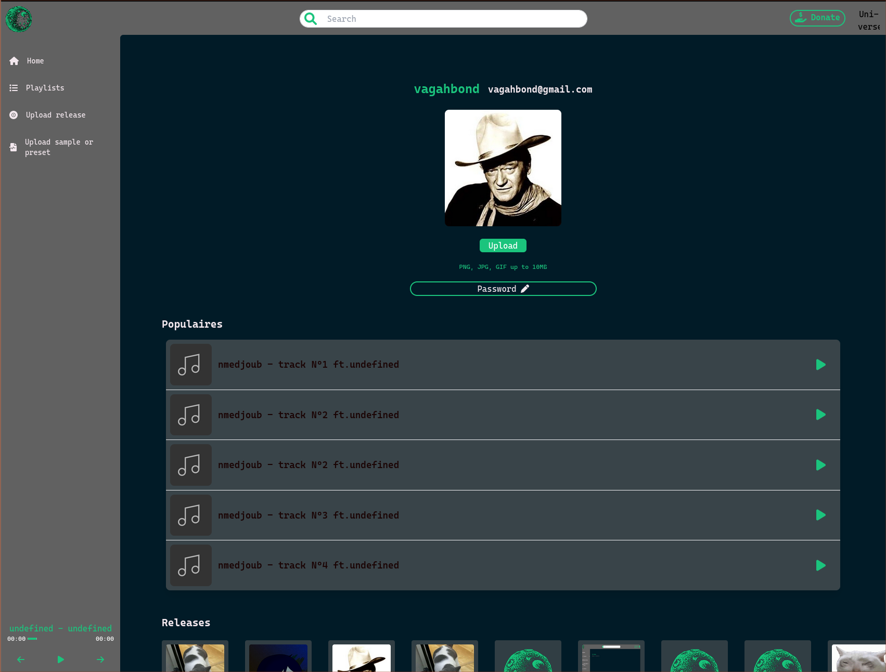

## Stack technique

### Typescript

Pour l'interface web de uni-verse, nous avons choisi d'utiliser NodeJS avec Typescript pour la maintenabilité.

### NextJS

Le site de uni-verse repose sur un framework appelé [NextJS](https://nextjs.org/docs/getting-started) qui permet d'utiliser React en server-side rendering. L'interêt d'un tel choix est la rapidité du site, ainsi qu'un meilleur SEO, du fait que les pages sont en partie servies statiques.

### TailwindCSS

L'aspect css du site est gérée avec [TailwindCss](https://tailwindcss.com/docs/installation), qui permet d'ajouter efficacement des styles aux elements de la DOM avec des noms de classes, dans la même idée que Bootstrap.

### Fontawesome

On utilise [FontAwesome](https://fontawesome.com/search?s=solid%2Cbrands) pour les icones à différents endroits du site, notament dans le lecteur de musique.

### Docker

Ce produit est distribué par le biais d'une image [docker](https://www.docker.com/), construite dans une pipeline Github-Actions et publiée dans un registre privé docker.
L'image docker permet de repliquer l'environnement dont Uni-verse a besoin en une seule commande, et de l'utiliser plus facilement sur le cloud.

### ESLint et Prettier

Afin d'enforcer les conventions de codage, [Eslint](https://eslint.org/) et [Prettier](https://prettier.io/) ont été mis en place et intégré dans GitHub-Actions.

### Kubernetes

Un déploiement et un service dans ce répo permettent de déployer facilement ce site en production dans Kubernetes.

### Github Actions

Github-Actions est utilisé pour plusieur aspects du projet:

1. Faire respecter les conventions de code en faisant tourner prettier et eslint sur chaque PR
2. Faire tourner les tests sur chaque PR et chaque nouveau commit dans `main`
3. Construire l'image docker et la publeir dans le registre privé à chaque release créée sur Github.

## Contribuer

### Environnement de développement

Il est conseillé de faire tourner en local le site web avec `npm run dev`. Afin que le site fonctionne correctement, plusieur variables doivent être renseignées dans un fichier `.env.local`:

```
STRIPE_PUBLISHABLE_KEY=
STRIPE_SECRET_KEY=
REACT_APP_API_URL=
GOOGLE_AUTH_CLIENT_ID=
GOOGLE_AUTH_CLIENT_SECRET=
SPOTIFY_AUTH_CLIENT_ID=
SPOTIFY_AUTH_CLIENT_SECRET=
JWT_SECRET=
NEXTAUTH_URL=
PORT=
NEXT_PUBLIC_MAX_FILE_SIZE=
NEXT_PUBLIC_MAX_IMAGE_SIZE=
NEXT_PUBLIC_MINIO_URL=
NEXT_PUBLIC_MAX_IMAGE_SIZE=
NEXT_PUBLIC_MAX_FILE_SIZE=
NEXT_PUBLIC_API_URL=
NEXT_PUBLIC_STRIPE_PUBLISHABLE_KEY=
NEXT_PUBLIC_UNIVERSE_PRIVATE_KEY=
NEXT_PUBLIC_STRIPE_PUBLIC_KEY=

```

Enfin, L'API doit être rendue disponible. Pour cela, se référer directrement à [la documentation de l'API.](https://github.com/uni-verse-fm/uni-verse-api).

### Conventions de codage

Les conventions de codage poussées par Prettier et ESLint sont basées sur les configurations recommendées directement par Nextjs. On peut les consulter [dans la documentation de NextJs](https://nextjs.org/docs/basic-features/eslint).

Les règles prncipales à retenir sont que les variables doivent être en lowerCamelCase, ainsi que les fonctions. Eslint veille aussi aux imports et variables non utilisees.

Si les conventions de codage ne sont pas respectées, une PR ne peut pas être mergée, car elle ne passera pas les testes de l'intégration continue.

## Production

Ce répos est prévu pour être mis en ligne à l'aide de Kuebrnetes.
Une config,ap doit lui être mise à disposition afin de fournir les variables d'environnements montrées plus haut.
Par ailleurs les variables préfixées par 'NEXT*PUBLIC*' doivent être présentes au moment du build de l'image docker. Cette condition est respectée dans Github-Actions, qui crée un fichier se servant des secrets et variables d'environnement de github pendant le build.
